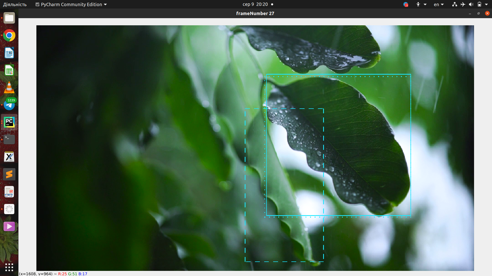

# AntDet_YOLOv5
Ants and their Activities (Trophallaxis) Detection using YOLOv5 based on PyTorch.

Author: Artem Lutov &lt;&#108;u&#97;&commat;&#108;ut&#97;n.ch&gt;, Valentyna Pryhodiuk &lt;v&#112;ryhodiuk&commat;lumais&#46;&#99;om&gt;  
License: [Apache License, Version 2](www.apache.org/licenses/LICENSE-2.0.html)  
Organizations: [UNIFR](https://www.unifr.ch), [Lutov Analytics](https://lutan.ch/), [LUMAIS](http://lumais.com)

**Table of Contents**
- [Requirements](#requirements)
- [:crystal_ball: orbAnalysis](#crystal_ball-orbanalysis)
  - [Description](#description)
    - [🔴 Connecting lines](#-connecting-lines)
    - [🟠 Feature IDs](#-feature-ids)
    - [🟡 ROI drawing mode](#-roi-drawing-mode)
    - [🟢 Navigation](#-navigation)
    - [🔵 Finish & Save](#-finish--save)
  - [Usage](#usage)
  - [Examples](#examples)
- [🛡️ lbxTorch](#️-lbxtorch)
  - [Description and Usage](#description-and-usage)
    - [:purple_circle: Converting the annotations from Labelbox format to YOLOv5 format](#purple_circle-converting-the-annotations-from-labelbox-format-to-yolov5-format)
    - [:brown_circle: Count the number of objects annotated by-hand](#brown_circle-count-the-number-of-objects-annotated-by-hand)
- [:radioactive: validAnnotations.py](#radioactive-validannotationspy)
  - [Description](#description-1)
  - [Usage](#usage-1)
  - [Example](#example)
- [:diving_mask: videoMask.py](#diving_mask-videomaskpy)
  - [Description](#description-2)
  - [Usage](#usage-2)
  - [Examples](#examples-1)
- [:eyes: visAnnotDiff.py](#eyes-visannotdiffpy)
  - [Description](#description-3)
    - [:exclamation: Explanation of the output:](#exclamation-explanation-of-the-output)
  - [Usage](#usage-3)
  - [Examples](#examples-2)
    - [:red_square: Count the modified objects](#red_square-count-the-modified-objects)
    - [:orange_square: Display the modifications](#orange_square-display-the-modifications)
    - [:yellow_square: Save the video with difference marked](#yellow_square-save-the-video-with-difference-marked)
- [:recycle: dataConverters.py](#recycle-dataconverterspy)
  - [Description](#description-4)

## Requirements
Install Python bindings:
```sh
$ python3 -m pip -r install requirements.txt 
```

## :crystal_ball: orbAnalysis
### Description
The script displays two successive consecutive frames, where annotated objects are surrounded by bounding boxes.
Annotations should follow the [Labelbox style](https://docs.labelbox.com/reference/bounding-box#export)
for the video annotations exporting. To simplify the ID tracking, objects with same ID are connected with the lines.
Possibilities of the script:
#### 🔴 Connecting lines
- Press `1` to turn on the mode where each line is visualised.
Line and bbox gets highlighted if the user hovers the mouse over the object.
- Press `2` to turn on the mode where only hovered objects have their lines displayed and highlighted.
- Press `3` to stop displaying the connecting lines.
#### 🟠 Feature IDs
 - `LB` click inside the object to start featureId changing mode. Borders become dashed.
   - If you want to **exchange** the featureId with another object,
   do the `LB` click inside that object on the **left frame**.
   Exchange automatically performs on every consecutive slide starting with the right frame.
   - If you want to interrupt the process and **perform the featureId changing mode
   on another object**, do the `LB` click inside that object on the **right frame**.
 - `LB` click outside the object:
   - On the right frame to interrupt featureId changing mode.
   - On the left frame nothing would happen.
#### 🟡 ROI drawing mode
Script allows to draw/display not more than one ROI. 
1. To allow ROI drawing mode press `d` 
2. To draw ROI press `LB` on the mouse and drag the cursor until you are satisfied
with the result.
   1. Drawing mode turns off automatically after the ROI is drawn.
   2. To clear the ROI press `RB` or `Del` for Linux users.
   3. To draw another ROI clear it using previous list item ⬆️ and
   repeat everything listed above in this section. 

#### 🟢 Navigation
 - To switch to the previous frame press `p`
 - To switch to the next frame press `n`

#### 🔵 Finish & Save
 Press `q` or `Esc` to finish and to save the progress as a \<filename>_imp.json 
### Usage
```commandline
$ ./orbAnalysis.py -h

usage: orbAnalysis.py [-h] [-vid VIDEO] [-a ANNOTATIONS]
                      [-hor HORIZONTAL | -ver VERTICAL] [-wsize WSIZE]

Document Taxonomy Builder.

optional arguments:
  -h, --help            show this help message and exit
  -vid VIDEO, --video VIDEO
                        path to video (default: test-
                        parameters/Cflo_troph_count_masked_6-00_6-31.mp4)
  -a ANNOTATIONS, --annotations ANNOTATIONS
                        path to the MAL annotations (default: test-parameters/
                        Cflo_troph_count_masked_6-00_6-31_MAL_withId.json)
  -hor HORIZONTAL, --horizontal HORIZONTAL
                        type of images' stack (default: None)
  -ver VERTICAL, --vertical VERTICAL
                        type of images' stack (default: None)
  -wsize WSIZE          Your screen parameters WxH (default: 1600x1200)
```
### Examples
To run the code on test parameters simply call
```sh
./orbAnalysis.py
```
First picture is the result of running the previous code line. The default line mode is 1.

The following picture represents the second line mode.

And the last picture is the example of using the third mode.


To run the code on <annotation.json> on <video.mp4> and stick it vertically. 
```sh
./orbAnalysis.py -vid video.mp4 -a annotation.json -ver true
```
## 🛡️ lbxTorch

### Description and Usage
Evaluation and conversion script for counting annotated objects on one label imported from Labelbox
and converting latter annotations into YOLOv5 format.

```commandline
$ ./lbxTorch.py -h

usage: lbxTorch.py [-h] -json-path FILEPATH [FILEPATH ...] [-s FRAME_SIZE] [-o OUTP_DIR] [-f FRAMES] [-k]

Document Taxonomy Builder.

optional arguments:
  -h, --help            show this help message and exit
  -json-path FILEPATH [FILEPATH ...], --filepath FILEPATH [FILEPATH ...]
                        Path for json files (default: None)
  -s FRAME_SIZE, --frame-size FRAME_SIZE
                        The size format is WxH, for example: 800x600 (default: None)
  -o OUTP_DIR, --outp-dir OUTP_DIR
                        Output directory for the label files (default: /home/valia/PycharmProjects/AntDet_YOLOv5/labels)
  -f FRAMES, --frames FRAMES
                        Range of frames (default: 1-$)
  -k, --keyframed-objects
                        True if annotations should be counted (default: False)

```

Script supports two different scenarios:
#### :purple_circle: Converting the annotations from Labelbox format to YOLOv5 format
Annotations in [Labelbox style](https://docs.labelbox.com/reference/bounding-box#export) for a video
got converted into the [YOLOv5 style](https://blog.paperspace.com/train-yolov5-custom-data/).
To use the script for this task  `-s, --frame-size` argument should be passed.
```commandline
./lbxTorch.py --json-path annotations.json -f 5-14 -s 800x600
```
#### :brown_circle: Count the number of objects annotated by-hand
Annotations in [Labelbox style](https://docs.labelbox.com/reference/bounding-box#export) for a video
got counted if they were annotated by-hand. To use the script for this task `-k` argument should be passed.

```commandline
./lbxTorch.py --json-path annotations.json -f 5-14 -k
```

## :radioactive: validAnnotations.py

### Description
Validation script for correction of the by-hand video annotation exported from
[Labelbox](https://docs.labelbox.com/reference/bounding-box#export) returns the
Antlist object, which is a list with extra methods added and saved the `new.json`
file with fixed annotations. Correction looks for flying heads (object was meant
to be the ant's head, but user accidentally switched feature ids of two objects)
to warn the user about their occurrence and cuts the ant's head if the borders
of the head go beyond the borders of the body.

### Usage
```commandline
./validAnnotations.py -h

usage: validAnnotations.py [-h] -a ANNOTATIONS [-r ROI]

Document Taxonomy Builder.

required arguments:
  -a ANNOTATIONS, --annotations ANNOTATIONS
                        Path to an annotation file (default: None)
optional arguments:
  -h, --help            show this help message and exit
  -r ROI, --roi ROI     Path to the ROI file (default: None)
```

### Example
```commandline
./validAnnotations.py -a annotations.json
```

## :diving_mask: videoMask.py

### Description
Masking the trophallaxis events for ant videos.

### Usage
```commandline
./videoMask.py -h
usage: videoMask.py [-h] -v VIDPATH -r ROIS [-f FILENAME] [-c COLOR | -rand]

Document Taxonomy Builder.

required arguments:
  -v VIDPATH, --vidpath VIDPATH
                        path to video (default: None)
  -r ROIS, --rois ROIS  LEFT,TOP,WIDTH,HEIGHT[;SHAPE=rect][^FRAME_START=1][!FRAME_FINISH=LAST_FRAME]] (default: [])

optional arguments:
  -h, --help            show this help message and exit
  -f FILENAME, --filename FILENAME
                        name for a processed video (default: None)
  -c COLOR, --color COLOR
                        color written as a word like pink, aqua, etc. (default: None)
  -rand                 True if background needs to be randomly colored (default: False)
```
### Examples
To run the script on the video from the existing folder try the following line.
The new video will appear in the "imgs" folder with the ROI with
the left corner coordinates (500,300) and the width equal 800, while height equal 600,
but ROI would appear starting from the 40th frame. Masking colors are random. 
```commandline
./videoMask.py -v imgs/mixkit-leaves-wet.mp4 -r 500,300,800,600^40 -f imgs/mixkit-leaves-wet-with-roi.mp4
```
To get the same effect, but with the ellipse shape of the ROI and on the constant color run.
```commandline
./videoMask.py -v imgs/mixkit-leaves-wet.mp4 -r 500,300,800,600;ellipse^40 -c lightpink -f imgs/mixkit-leaves-wet-with-roi.mp4
```
Let's come back to the rectangle, but choose another area and let ROI stop appearing after 60th frame.
And lets color the pixel of the mask randomly, but make the static filling.
```commandline
./videoMask.py -v imgs/mixkit-leaves-wet.mp4 -r 200,200,1100,800;^20!60 -rand -f imgs/mixkit-leaves-wet-with-roi.mp4
```
Accidental wrong height and the width of the ROI is not a problem. Script would fit your ROI into the frame.
But script doesn't support the wrong left corner coordinates, choose them wisely.
```commandline
./videoMask.py -v imgs/mixkit-leaves-wet.mp4 -r 10,10,12800,12600;ellipse^40 -rand -f imgs/mixkit-leaves-wet-with-roi.mp4
```

## :eyes: visAnnotDiff.py

### Description
Evaluation and visualization script for annotation review. Detect the changes which were done by the reviewer automatically
can be in handy for long video with countless objects. The following script works in two modes:
- count the objects which were modified by the reviewer due to the given files; 
- display the objects which differ on the given files;
- save the video with marked differences.

#### :exclamation: Explanation of the output:
- Corrected classes: number of changes among objects, not obligatorily done on hand.
- Corrected attributes: number of changes among attributes, not obligatorily done on hand.
- Corrected classes in keyframes: number of changes among objects done **on hand.**
- Corrected attributes in keyframes: number of changes among attributes done **on hand.**

:exclamation: Don't be upset if your objects where not counted by this script. Go to lbxTorch.py file and hardcode
you own classes into the global variable class_name_to_id_mapping on the 15th line.

### Usage
```commandline
./visAnnotDiff.py -h
usage: visAnnotDiff.py [-h] -a ANNOTATED -r REVIEWED [-v VIDEO] [-o VIDREVIEW] [-k KEYFRAMES] [-e EPSILON]

Document Taxonomy Builder.

optional arguments:
  -h, --help            show this help message and exit
  -a ANNOTATED, --annotated ANNOTATED
                        Path to the JSON file of original annotations (default: None)
  -r REVIEWED, --reviewed REVIEWED
                        Path to the JSON file of reviewed annotations (default: None)
  -v VIDEO, --video VIDEO
                        Path to the original video (default: )
  -o VIDREVIEW, --output-video VIDREVIEW
                        Output video instead of the interactive analysis (default: None)
  -k KEYFRAMES, --keyframes KEYFRAMES
                        Target intervals of frames if necessary (default: 1-$)
  -e EPSILON, --epsilon EPSILON
                        The maximum permissible error of the bbox dimension (default: 0)
```

### Examples
#### :red_square: Count the modified objects
To use this mode parameters `-v` and `-o` are not used. In this case we used `-e` equal 2
if we don't mind that any of the object's dimensions would change less than for 2 pixels, but
current argument is optional.
```commandline
./visAnnotDiff.py  -a imgs/leaf_original.json -r imgs/leaf_review.json -k 1-35 -e 2
```
#### :orange_square: Display the modifications
To use this mode parameter `-v` appears. We use it to let the script display the modified annotations
on the given video.
- The **dotted** bounding box means that this object was modified on hand.
- The **dashed** bounding box means that the object was created by a reviewer.
- The classic style bounding box represents the annotation before the review.
To switch to the next slide press `space` and to finish the visualization press `Esc`.
```commandline
./visAnnotDiff.py  -a imgs/leaf_original.json -r imgs/leaf_review.json -v imgs/mixkit-leaves-wet.mp4
```


#### :yellow_square: Save the video with difference marked
In this mode both `-v` and `-o` parameters should be present. No visualization, but the video
with marked bounding boxes would be saved with the given name to the following folder.
```commandline
./visAnnotDiff.py -a imgs/leaf_original.json -r imgs/leaf_review.json -v imgs/mixkit-leaves-wet.mp4 -o imgs/visdif_leaves.mp4
```

## :recycle: dataConverters.py

### Description
Script consists of converters. Possibilities:
- convert_yn: YOLO -> Labelbox import (new)
- convert_yo: YOLO -> Labelbox export (old)
- convert_no: Labelbox import (new) -> Labelbox export (old).

The difference among the Lablebox formats can be observed [here](https://docs.labelbox.com/reference/bounding-box).